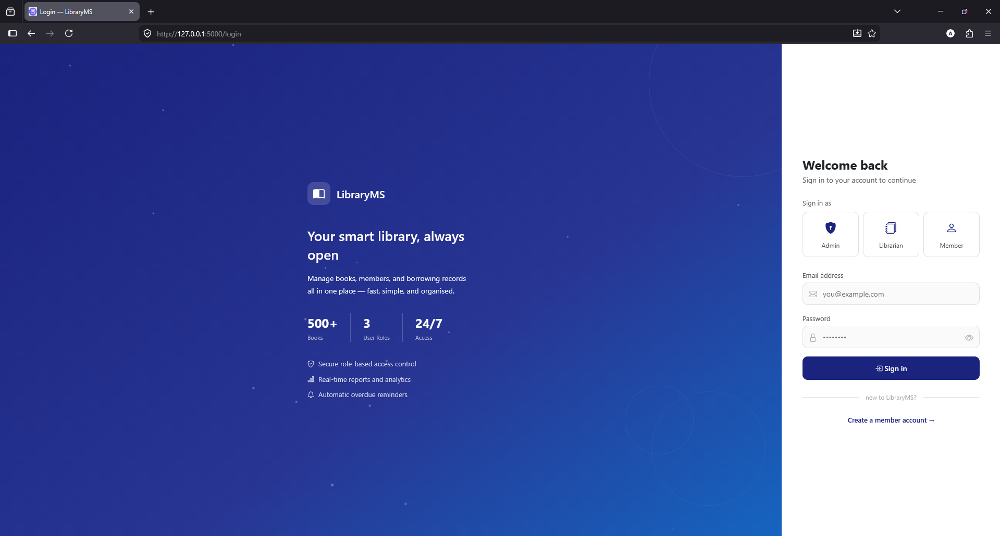
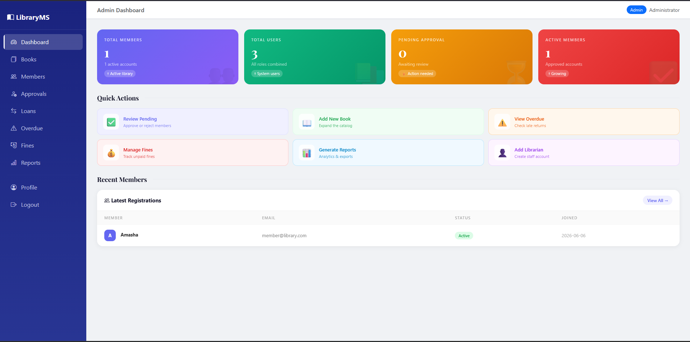
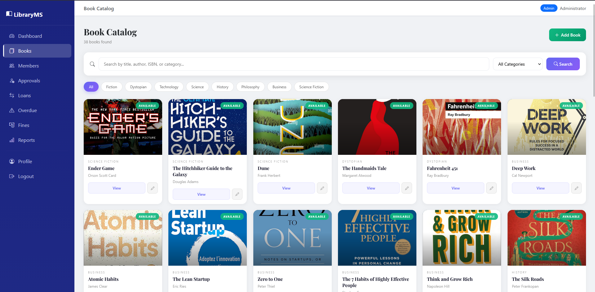

# 📚 LibraryMS — Online Library Management System

A full-featured web-based library management system built with Python/Flask, SQLite, and Bootstrap 5. Designed for Jingdezhen Ceramic University Software Engineering course project.


---

## ✨ Features

- 🔐 **Role-based authentication** — Admin, Librarian, and Member roles
- 📖 **Book catalog** — 38+ books with category-based gradient covers and search
- 👥 **Member management** — Registration, admin approval workflow
- 📤 **Borrow & Return** — Up to 5 books per member, 14-day loan period
- 💰 **Fine calculation** — Automatic ¥0.50/day overdue fine tracking
- 📊 **Reports & CSV export** — Most borrowed, overdue members, daily transactions
- 🎨 **Modern UI** — Animated pages, Playfair Display typography, gradient design
- ✅ **16 automated tests** — Full PyTest suite with 100% pass rate

---

## 🖥️ Screenshots

### Login Page


### Admin Dashboard


### Book Catalog


---

## 🚀 Quick Start

### Prerequisites
- Python 3.x (via Miniconda or Anaconda)
- Git

### Installation

**1. Clone the repository**
```bash
git clone https://github.com/Amasha2004/library-management-system
cd library-management-system
```

**2. Install dependencies**
```bash
pip install flask flask-sqlalchemy flask-login flask-mail flask-bcrypt werkzeug pytest
```

**3. Initialize database and create admin account**
```bash
python setup.py
```

**4. Run the application**
```bash
python run.py
```

**5. Open in browser**

---

## 🔑 Default Login Credentials

| Role | Email | Password |
|------|-------|----------|
| Admin | admin@library.com | admin123 |
| Librarian | librarian@library.com | librarian123 |

---

## 📁 Project Structure

---

## 🧪 Running Tests

```bash
pytest tests/test_app.py -v
```

Expected output: **16 passed**

---

## 👥 User Roles

| Role | Permissions |
|------|------------|
| **Admin** | Full system access, approve members, generate reports, manage everything |
| **Librarian** | Manage books, process borrows/returns, calculate fines |
| **Member** | Browse catalog, borrow books, view history |

---

## 🏗️ Tech Stack

| Layer | Technology |
|-------|-----------|
| Backend | Python 3.x + Flask 3.1 |
| Database | SQLite + SQLAlchemy ORM |
| Authentication | Flask-Login + Flask-Bcrypt |
| Frontend | HTML5 + CSS3 + Bootstrap 5.3 |
| Typography | Google Fonts (Playfair Display) |
| Testing | PyTest 9.0 |

---

## 📄 License

This project was developed as a university course assignment for Software Engineering at Jingdezhen Ceramic University.

**Student:** Amasha | **Student ID:** L20231129